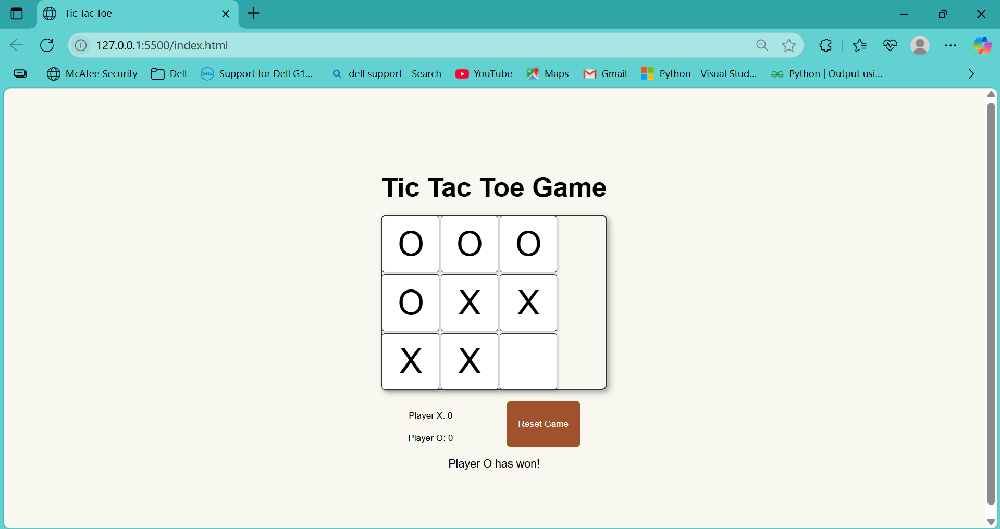
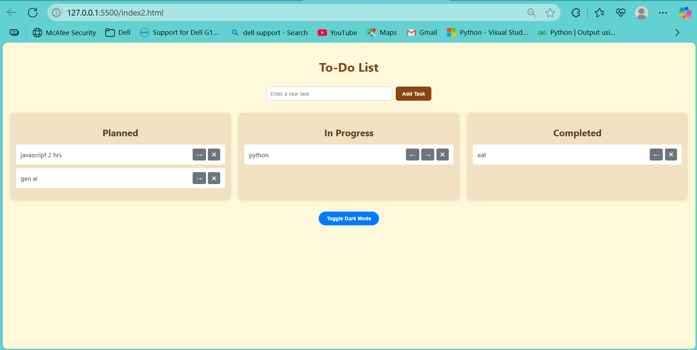

# 🤖 CLI Terminal-Based AI Agent

A command-line AI assistant built in Python using the Gemini 1.5 API. This lightweight tool helps you *automate repetitive terminal tasks* like fetching weather, running shell commands, and creating files — all via *natural language input*.

---

## 📦 Features (aka Tools You Can Use)

The AI understands your queries and maps them to actual Python functions:

| Tool Name     | Function Description                                                                 |
|---------------|----------------------------------------------------------------------------------------|
| `get_weather` | Fetches current weather data for any city using [wttr.in](https://wttr.in)            |
| `run_command` | Executes terminal (Windows CMD) commands like `dir`, `mkdir`, `python file.py`, etc. |
| `write_file`  | Creates a `.txt` or `.py` file and writes content into it safely                      |

---

## 💻 How It Works

> It follows a simple **PLAN → ACTION → OBSERVE → OUTPUT** loop using Google's Gemini API.

### 🔄 Example Workflow

**User Input:**  
Make a simple Instagram clone for login

**Agent Response:**
Step: Plan → Create an HTML and CSS file for the login UI

Step: Action → Call write_file tool with login.html and login.css

Step: Observe → Files created successfully

Step: Output → Basic Instagram-style login page generated

---

## 🧠 Technologies Used

- Python 3.x  
- [Google Generative AI SDK (Gemini 1.5 Flash)](https://ai.google.dev/)  
- Weather API via [wttr.in](https://wttr.in)  
- `python-dotenv` for environment variable handling  
- `os`, `subprocess` for Windows terminal command execution  

---

 ## 🗂️ Project Structure

CLI-terminal-based-ai-agent/

├── .gitignore                       # Specifies untracked files to ignore

├── requirements.txt                 # Lists Python dependencies

├── main_code.py                     # Core logic of the CLI AI agent

├── README.md                        # Project documentation (you are here)

├── .env                             # Contains your Gemini API key (not committed)

├── venv/                            # Your Python virtual environment (optional)

├── screenshot/                      # Folder containing proof-of-work images

---

## 📸 Proof of Work

✅ **Tic Tac Toe (Python CLI)**  
A mini HTML/CSS/Javascript -based game created using the `write_file` tool.

---

✅ **To-Do List (Frontend Website)**  
Basic HTML/CSS/Javascript -based To-Do web app — built using CLI instructions!

---
---
💡 Inspired and built with guidance from:Hitesh Choudhary sir And Piyush sir

⭐️ Star this repo if you found it helpful!
Made with ❤️ by Rajanna Adhikary
